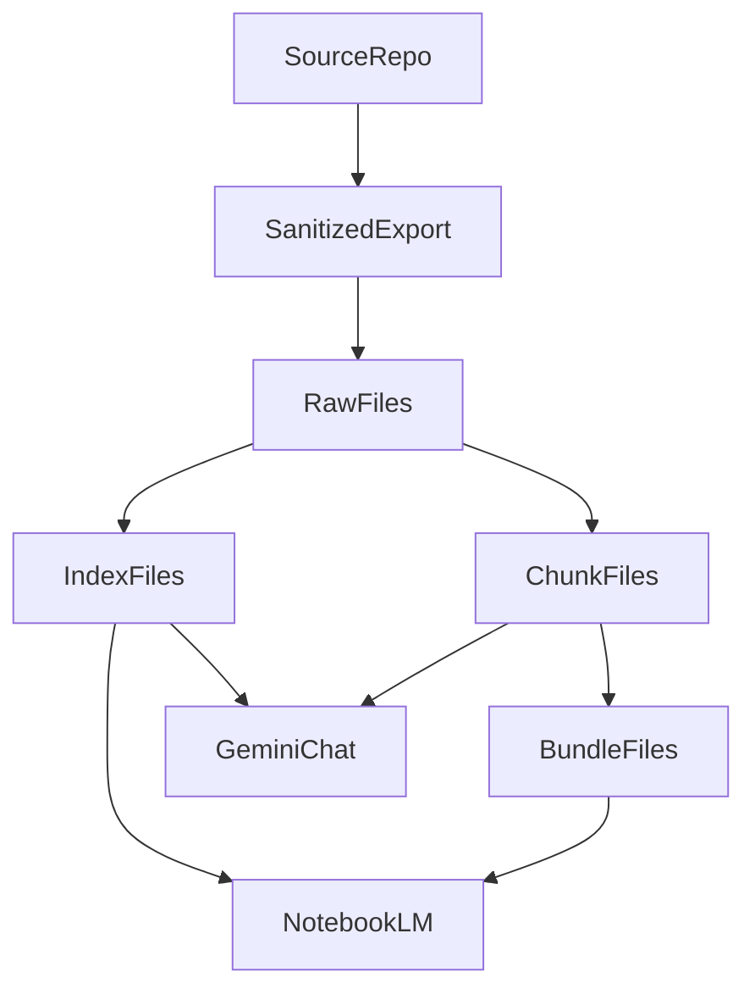

# Geminiコンテキスト戦略

## 目的

この文書は、Playwrightプロジェクトのサニタイズ済みエクスポートを、GeminiとNotebookLMで実運用するための方針を整理する。

このリポジトリは現時点で、`sourcePaths` に基づく安全な縮小エクスポート、`README_FOR_AI.md` の生成、`manifest.json` によるレビュー支援を提供している。今後はこれを土台にして、Geminiのチャットスレッドへ一式をそのまま渡す運用から、必要な断面だけを参照する運用へ移行する。

## 背景

Geminiの通常チャットは、1つのスレッドに長期間すべてのコード断面を保持し続ける用途には向かない。

- Playwright一式をファイル添付や貼り付けで渡すと、会話が進むにつれてコンテキストを圧迫しやすい
- コード、補足資料、設計意図、過去のやり取りが同じ窓を奪い合う
- ディレクトリ構造や関連ファイルの結びつきが、会話だけでは薄れやすい
- 巨大なファイルや大量ファイルを渡しても、常に全体を精密に参照できるとは限らない

そのため、Geminiチャットを唯一の保管場所にせず、NotebookLMを知識ベースとして併用する。

## 基本方針

推奨する運用は次の4層構成とする。

1. サニタイズ済みの`raw files`を出力する
2. `raw files`を索引化した`index`を作る
3. 精読単位に分割した`chunk`を作る
4. 話題ごとにまとめた`bundle`を作る

役割のイメージは次のとおり。



- NotebookLMは中長期の知識ベースとして使う
- Geminiチャットは作業窓として使う
- 毎回すべてを渡さず、`index` と必要な `chunk` だけを都度渡す

## 現在の実装位置づけ

現状のこのリポジトリは、次の段階までは実装済みである。

- `sourcePaths`によるallowlist export
- 機密らしい文字列のredaction
- `fixtures/sandbox` 向けの匿名化
- `README_FOR_AI.md` の生成
- `manifest.json` によるレビュー

一方で、次はまだ今後の実装対象である。

- `index` の生成
- `chunk` の生成
- `bundle` の生成
- Gemini/NotebookLM向けの最適化済みメタデータ出力

つまり、このツールは現時点では「安全な縮小エクスポーター」であり、今後「知識パッケージ生成器」へ広げる設計を採る。

## 出力物の役割

### 1. `index`

`index` は、どのファイルが何者かをGeminiやNotebookLMに短く伝えるための索引である。

含めたい情報:

- 元の相対パス
- 種別: `spec` / `page` / `helper` / `fixture` / `config` / `doc`
- 役割の要約
- 主要シンボルや主題
- 関連ファイル
- 依存関係のヒント

`index` は、まず `PROJECT_INDEX.md` や `PATH_INDEX.jsonl` のような小さいファイル群として持つのが扱いやすい。

例:

```json
{
  "path": "playwright/tests/auth/login.spec.ts",
  "kind": "spec",
  "summary": "ログイン導線を検証する主要spec",
  "symbols": ["login flow", "invalid password"],
  "relatedPaths": [
    "playwright/pages/auth/login-page.ts",
    "playwright/helpers/session.ts"
  ]
}
```

`index` の役割は全文の代替ではなく、「何を次に開くべきか」をAIに判断させる案内板である。

### 2. `chunk`

`chunk` は、実際のコードを精読させるための最小単位である。

設計の原則:

- 1chunkは小さく保つ
- 元パスを必ず持つ
- 可能なら関数、クラス、specブロックなど意味の切れ目で分割する
- 前後が読める程度の文脈を残す

含めたい情報:

- `original_path`
- `chunk_id`
- `section`
- `symbols`
- `depends_on`

例:

```md
---
original_path: playwright/tests/auth/login.spec.ts
chunk_id: playwright__tests__auth__login.spec.ts__001
section: successful login flow
symbols:
  - test.describe("login")
  - test("ログイン成功")
depends_on:
  - playwright/pages/auth/login-page.ts
---
```

`chunk`はGeminiチャットへ直接添付する主な単位になる。大きい`raw file`を丸ごと渡す代わりに、必要な`chunk`だけを渡す。

### 3. `bundle`

`bundle` は、複数の `chunk` や関連ファイルを、話題単位でまとめた中間サイズの資料である。

向いているテーマ:

- 認証
- 決済
- `fixture`と`test data`
- `locator`方針
- `page object`層

`bundle` に含めたいもの:

- テーマの概要
- 関連ファイル一覧
- 関連`chunk`一覧
- 最小限のコード抜粋
- このテーマでの実装ルール

例:

```md
# bundle-auth

## 概要
- ログイン、ログアウト、認証済み状態の再利用を扱う

## 関連ファイル
- playwright/tests/auth/login.spec.ts
- playwright/pages/auth/login-page.ts
- playwright/helpers/session.ts
```

`bundle`はNotebookLMに置くと強く、Geminiチャットには必要時だけ追加する。

## メタデータの原則

ディレクトリ構造やファイル対応を会話だけに頼らず、各成果物にメタデータを埋め込む。

最低限の原則:

- 元パスは必須
- 種別は必須
- 関連ファイルは可能な限り持つ
- AI向けの短い要約を持つ
- 同じ情報を `index` と `chunk` の両方から追えるようにする

推奨キー:

- `path`
- `kind`
- `summary`
- `symbols`
- `relatedPaths`
- `dependsOn`
- `usedBy`
- `chunkId`

## NotebookLM と Gemini の役割分担

### NotebookLM に置くもの

- `index`
- `bundle`
- 運用ルール文書
- `AI_CONTEXT.md`
- 必要に応じて一部の `chunk`

NotebookLMは、広く俯瞰しながら「どの資料に何があるか」を探す用途に向く。

### Gemini チャットに渡すもの

- `PROJECT_INDEX.md` のような小さい索引
- そのタスクに必要な `chunk`
- 必要に応じてテーマ別 `bundle`
- ユーザーがその場で追加する仕様や制約

Geminiチャットは、都度の実作業、レビュー、コード提案に使う。

### 基本原則

- NotebookLMは知識ベース
- Geminiチャットは作業窓
- 両者の役割を分ける

## 実運用フロー

推奨フローは次のとおり。

1. 対象プロジェクトから、既存CLIでサニタイズ済み`raw files`を出力する
2. 出力結果を人間が `manifest.json` で確認する
3. `raw files`から`index`と`chunk`を生成する
4. 必要に応じてテーマ別 `bundle` を生成する
5. `index`と`bundle`をNotebookLMに登録する
6. Geminiチャットでは `index` と必要な `chunk` だけを添付する

この流れなら、毎回同じ大量ファイルを会話へ載せ直さずに済む。

## 既存ファイルとの関係

### `README_FOR_AI.md`

現状の`README_FOR_AI.md`は、エクスポート全体の説明と制約の要約を担っている。今後は、これを`raw files`全体の案内として残しつつ、`index`や`bundle`の入口も示せるように拡張する。

### `manifest.json`

`manifest.json` は、人間がエクスポート内容を確認するための監査記録である。今後はここに、次のような集計情報を追加できるようにする。

- `indexFiles`
- `chunkFiles`
- `bundleFiles`
- `chunkCount`
- `bundleCount`

### `AI_CONTEXT.md`

`AI_CONTEXT.md` は、人間がメンテするプロジェクト固有知識として引き続き重要である。`index` や `bundle` を補強する、運用ルールの一次情報として扱う。

## 実装方針

`index/chunk/bundle` は、既存のコピー処理を壊さず、後段フェーズとして生成する。

### なぜ後段フェーズにするか

- 既存の`copy-pipeline`は、1ファイルごとの安全なexportに責務が絞られている
- `chunk`はredactionと匿名化が終わった後のテキストを対象にしたい
- `index` と `bundle` は複数ファイルを横断して組み立てるため、コピー処理とは関心事が違う

したがって、`copy-pipeline` に責務を足し込むのではなく、`cli` から呼ぶ別モジュールとして構成する。

## 将来の変更ポイント

### `tools/gemini-export/cli.mjs`

将来的な責務:

- export完了後に`index/chunk/bundle`生成フェーズを呼ぶ
- 結果を `manifest` に集約する
- dry-run時の件数表示を整える

### `tools/gemini-export/default-config.mjs`

将来的な責務:

- `index/chunk/bundle` 用の既定値を持つ
- 生成ON/OFF、対象拡張子、出力パス、チャンクサイズなどを保持する

### `tools/gemini-export/config.mjs`

将来的な責務:

- 新しい設定キーの読込と検証
- 既定値とのマージ

### `tools/gemini-export/readme.mjs`

将来的な責務:

- `README_FOR_AI.md`に`index/chunk/bundle`の要約を加える
- NotebookLM / Geminiでの使い分けを短く説明する

### `tools/lib/gemini-export-pure.mjs`

将来的な責務:

- chunk分割
- メタデータ整形
- ハッシュやID生成などの純粋関数

### `test/unit/`

将来的な責務:

- chunk分割やメタデータ整形のユニットテスト

### `test/integration/export-cli.test.mjs`

将来的な責務:

- `index` / `chunk` / `bundle` の生成確認
- `--check` 時の振る舞い確認

## 段階的な実装順

初回の実装順は次を推奨する。

1. 文書化を先に行い、出力物の責務を固定する
2. `index + chunk` を先に実装する
3. NotebookLM向けの運用を固める
4. `bundle` はテーマ分類のルールが見えた時点で追加する

## まず最低限ほしい成果物

最初の目標としては、次の出力物があると運用を始めやすい。

- `PROJECT_INDEX.md`
- `PATH_INDEX.jsonl`
- `chunks/`
- `README_FOR_AI.md`
- `manifest.json`

この時点で、NotebookLMには`PROJECT_INDEX.md`とテーマ別に絞った資料を入れ、Geminiチャットには`PROJECT_INDEX.md`と必要な`chunk`だけを渡す運用が可能になる。

## 判断基準

次のような場合は、1つのチャットにすべて載せるよりも、`index/chunk/bundle` 戦略を優先する。

- Playwright配下のファイル数が多い
- `spec`、`page`、`helper`、`fixture`の関係が複雑
- 継続的に複数タスクで同じ知識ベースを使い回したい
- 1回の会話で扱うべき断面が毎回変わる

逆に、小規模で短期のやり取りなら`raw files`を少数だけ直接渡す運用でもよい。

## まとめ

このリポジトリの今後の方針は、次の一文で要約できる。

> Geminiチャットは作業窓、NotebookLMは知識ベースと割り切り、Playwrightのエクスポートは `index`・`chunk`・`bundle` に再構成して必要な断面だけを渡す。
