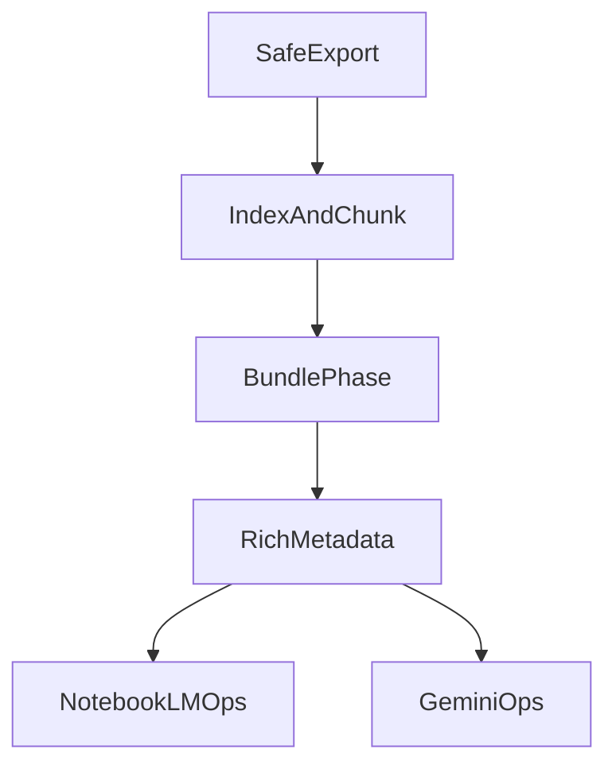

# Gemini Export ロードマップ

## 目的

この文書は、`index + chunk`実装後の現在地を確認し、このツールをGemini / NotebookLM向けの実運用ツールとして育てるための次の優先事項を整理する。

## 現在地

現時点で、このリポジトリには次が実装されている。

- `sourcePaths`による安全な縮小エクスポート
- テキストベースのredaction
- `fixtures/sandbox`向け匿名化
- `README_FOR_AI.md`と`manifest.json`の生成
- `indexChunk`設定による`PROJECT_INDEX.md` / `PATH_INDEX.jsonl` / `chunks/`の生成
- `.gemini-export.json`の`indexChunk.enabled`に加え、CLIの`--index-chunk`で当該実行のみ有効化可能（CLIが設定より優先）
- `--check`単体では`index + chunk`の成果物はディスクへ書かない。`--check --index-chunk`併用時は標準出力にPATH_INDEX行数・chunk数の概算のみ出す
- `PROJECT_INDEX.md`のファイル一覧は行数上限があり、超過分は省略行で`PATH_INDEX.jsonl`へ誘導する
- chunkのYAMLフロントマターに`kind`（`guessFileKind`）を含める

`index + chunk`に関する前回の残タスクは、現状のコードとテストを見る限り解消済みと判断してよい。

確認済みの要点:

- `manifest`は`indexFiles` / `chunkFiles` / `chunkCount`を保持する
- `README_FOR_AI.md`は`indexFiles`と`chunkCount`を要約する
- `--check`単体では`index + chunk`の追加ファイルは生成されない
- `--check --index-chunk`では概算ログのみ（ファイルは生成しない）
- integrationテストで`PATH_INDEX.jsonl`とchunkフロントマター（`original_path` / `chunk_id` / `kind`）の契約を検証している

したがって、**`index + chunk`の前回計画に対する残タスクはない**と結論する。

## 今後の課題（計画で見送り・低優先）

次は別イテレーションで扱う想定の項目である（詳細はコードコメントおよび本ロードマップの優先度節を参照）。

- **`bundle`生成本体** … 優先度1として本ロードマップに記載済み
- **`index-chunk.mjs`のモジュール分割** … 単一モジュール肥大化時にオーケストレータ＋分割を検討
- **`chunkIdBaseFromRelPath`の衝突リスク** … パス要素に`__`が含まれる場合のID衝突を緩和する余地
- **長行フォールバックの精密化** … `splitTextByMaxBytes`内の巨大1行向け分割はMVP（低優先で改善可）

## 目標像

このツールの次の到達像は、単なる「安全な縮小エクスポーター」ではなく、GeminiとNotebookLMで再利用しやすい「AI向け知識パッケージ生成ツール」である。

役割分担は次のとおり。

- Gemini: 作業窓
- NotebookLM: 知識ベース
- Export tool: `raw files` / `index` / `chunk` / `bundle` / `metadata`を整形して供給する基盤

## ロードマップ

### 優先度1: `bundle` 生成

`index + chunk`の次にもっとも価値が高いのは`bundle`である。

背景:

- `index`は入口として優秀だが、テーマ単位での中間粒度がまだない
- `chunk`は精読向きだが、関連する断片が散らばりやすい
- NotebookLMに入れる資料としては、`bundle`がもっとも使いやすい

やること:

- 認証、`locator`方針、`fixture`、`page object`などのテーマ別bundleを生成する
- 関連ファイル一覧、関連`chunk`一覧、概要、実装上の注意点を含める
- まずは自動分類を単純にして、最初はルールベースでもよい

期待する効果:

- NotebookLMに入れる資料の粒度が整う
- Geminiチャットに「必要な塊」だけ渡しやすくなる

### 優先度2: `PATH_INDEX.jsonl` の強化

現在の`PATH_INDEX.jsonl`は、最低限のメタデータだけを持つMVPである。次は、検索や関連づけに強い索引へ育てるべきである。

まず追加したい項目:

- `summary`
- `symbols`
- `relatedPaths`
- `dependsOn`
- `usedBy`

とくに`summary`は現状空文字なので、最初の改善対象として優先度が高い。

候補となる生成方法:

- ファイルパス規則からの推定
- 簡易なAST / 正規表現ベースのシンボル抽出
- `spec` / `page` / `helper` / `fixture`の種類ごとのヒューリスティック

### 優先度3: chunk 品質の向上

現在のchunk分割は、`maxChunkBytes`によるUTF-8バイト上限のもとで行単位にバッファリングするMVPである。安全で単純だが、意味単位としてはまだ粗い。

改善候補:

- 関数、クラス、`test.describe`、`test()` 単位での分割
- `section` や `symbols` の付与
- 前後文脈の軽いオーバーラップ
- 過度に小さいchunkや巨大chunkの調整

目標:

- Geminiがchunk単位で読んだときに、ファイル全体構造を誤解しにくくする
- NotebookLM側でも意味単位で引用しやすくする

### 優先度4: 出力テンプレートの整備

対象プロジェクトへ導入しやすくするため、`templates/`に実運用向けテンプレートを足す価値がある。

候補:

- `PROJECT_INDEX.md` の見本
- `bundle-*.md` の見本
- Playwright向けの`AI_CONTEXT.md`補助テンプレート
- NotebookLMへ登録する順序のメモ

狙い:

- チーム内で運用を共有しやすくする
- 初回導入時の試行錯誤を減らす

### 優先度5: CLI / config UX の改善

実運用段階では、設定やdry-runの見やすさも重要になる。

実施済みの例:

- `indexChunk`の説明と例を`README.md`および`.gemini-export.example.json`へ反映した
- `--index-chunk`フラグを追加した
- `--check --index-chunk`でPATH_INDEX行数・chunk数の概算を標準出力に出す

残りの候補:

- `bundle`実装後にREADMEへ`bundle`設定・出力物を追記する
- `manifest.json`の要約をより読みやすくする

### 優先度6: 運用支援ドキュメント

実装だけではなく、NotebookLMとGeminiの使い分けを文書として整備する余地がある。

候補:

- NotebookLMに何を先に入れるか
- Geminiチャットには何を最初に添付するか
- 大規模モノレポでの運用例
- 人間レビュー時のチェックリスト

## 依存関係

- `bundle`は`index + chunk`の上に乗る
- rich metadataは`bundle`と相互補強になる
- 運用支援は実装と並行で更新してよい

## 優先順位の判断基準

今後の優先順位は次で判断する。

- Geminiで最初に詰まりやすい点を先に解く
- NotebookLMに入れたときの再利用性が高いかを重視する
- セキュリティ境界を曖昧にする変更は、機能追加より先に慎重に設計する
- まずは自動生成の品質よりも、壊れにくい契約を優先する

## 当面の推奨順

次に着手するなら、順番は次がよい。

1. `bundle`のMVP
2. `PATH_INDEX.jsonl`の`summary`と`relatedPaths`
3. chunkの意味単位分割
4. テンプレート拡充
5. CLI/config UX改善（README・`--index-chunk`・dry-run概算は対応済み。残りはmanifest可読性など）
6. 運用支援ドキュメントの拡充

## まとめ

現時点で`index + chunk`の前回計画に対する残タスクはない。

今後の主戦場は、`bundle`、rich metadata、chunk品質、運用支援の4方向である。とくに、NotebookLMに入れやすく、Geminiに必要な塊だけを渡しやすくするために、次は`bundle`の整備を最優先とする。
