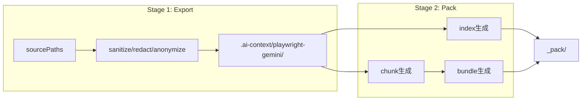

# Gemini Pack 機能の設計・実装

## 背景

既存ツールは「安全に縮小してファイルをコピーする」まではできているが、Gemini のコンテキストウィンドウに収めるための **索引化・分割・グルーピング** は未対応。`--pack` オプションで、エクスポート後に自動で index / chunk / bundle を生成する。

## 全体フロー



`--pack` を付けると Stage 2 も実行される。出力先は既存 `outDir` 配下の `_pack/` サブディレクトリ。

## Part 1: 文書化

### `docs/gemini-workflow.md` を新規作成

構成:

- **概念**: index / chunk / bundle それぞれの責務と違い
- **出力物一覧**: 各ファイルの形式・用途・サイズ目安
- **NotebookLM 運用ガイド**: 何を1ソースとして入れるか、推奨構成
- **Gemini チャット運用ガイド**: 会話開始時に何を渡し、途中で何を追加するか
- **フォーマット仕様**: chunk の YAML frontmatter、PATH_INDEX.jsonl のスキーマ、bundle の構造

## Part 2: 実装

### 2-1. 出力ディレクトリ構造

```text
.ai-context/playwright-gemini/
  [既存のサニタイズ済みファイル群]
  manifest.json
  README_FOR_AI.md
  _pack/
    PROJECT_INDEX.md        ... 全体概要 + ツリー + ファイル要約表
    DIRECTORY_TREE.md       ... ツリー表示のみ
    PATH_INDEX.jsonl        ... 1行1ファイル、JSON Lines形式
    bundles/
      bundle-tests-auth.md
      bundle-tests-checkout.md
      bundle-pages.md
      bundle-helpers.md
      bundle-fixtures.md
      bundle-config.md
    chunks/
      tests__auth__login.spec.ts.md
      pages__login-page.ts.md
      ...
```

### 2-2. CLI 変更: `--pack` オプション追加

[`tools/gemini-export/cli.mjs`](tools/gemini-export/cli.mjs) を変更:

- `--pack` フラグを解析
- 既存の export 完了後に `runPack()` を呼ぶ
- `--check --pack` の場合は pack も dry-run

### 2-3. 設定の拡張

[`tools/gemini-export/default-config.mjs`](tools/gemini-export/default-config.mjs) に `pack` セクションを追加:

```js
pack: {
  chunkMaxLines: 300,
  bundleGroupDepth: 2,
  outSubDir: "_pack"
}
```

### 2-4. 新規モジュール

- **`tools/gemini-export/pack.mjs`** - pack オーケストレータ。manifest を受け取り、index / chunk / bundle 生成を順に呼ぶ
- **`tools/gemini-export/pack-index.mjs`** - `PROJECT_INDEX.md`, `DIRECTORY_TREE.md`, `PATH_INDEX.jsonl` を生成
- **`tools/gemini-export/pack-chunk.mjs`** - 各ファイルを YAML frontmatter 付き Markdown chunk に変換。大きいファイルは分割
- **`tools/gemini-export/pack-bundle.mjs`** - chunk をディレクトリ + 役割でグルーピングし、bundle Markdown を生成

### 2-5. ファイル役割の自動分類ロジック

ハイブリッド戦略（ディレクトリ + 役割）:

- `*.spec.ts` / `*.test.ts` → `spec`
- `pages/` 配下 → `page`
- `helpers/` 配下 → `helper`
- `fixtures/` 配下 → `fixture`
- `*.config.*` / `tsconfig.*` / `package.json` → `config`
- それ以外 → `other`

bundle 名は `bundle-{ディレクトリ階層}-{役割}.md` の形式（例: `bundle-tests-auth.md`）。

### 2-6. chunk フォーマット

````md
---
original_path: playwright/tests/auth/login.spec.ts
chunk: 1/1
role: spec
symbols:
  - "describe: Login flow"
  - "test: should redirect to dashboard"
depends_on:
  - playwright/pages/auth/login-page.ts
---

```ts
// playwright/tests/auth/login.spec.ts
import { test, expect } from "@playwright/test";
// ...
```
````

### 2-7. テスト

- `test/unit/pack-index.test.mjs` - index 生成の単体テスト
- `test/unit/pack-chunk.test.mjs` - chunk 分割・frontmatter 生成のテスト
- `test/unit/pack-bundle.test.mjs` - bundle グルーピングのテスト
- `test/integration/export-cli.test.mjs` に `--pack` 統合テストを追加

### 2-8. README 更新

[`README.md`](README.md) に `--pack` オプションの簡潔な説明と `docs/gemini-workflow.md` へのリンクを追加。

### 2-9. lint

最後に `npm run lint` で全体を確認。
