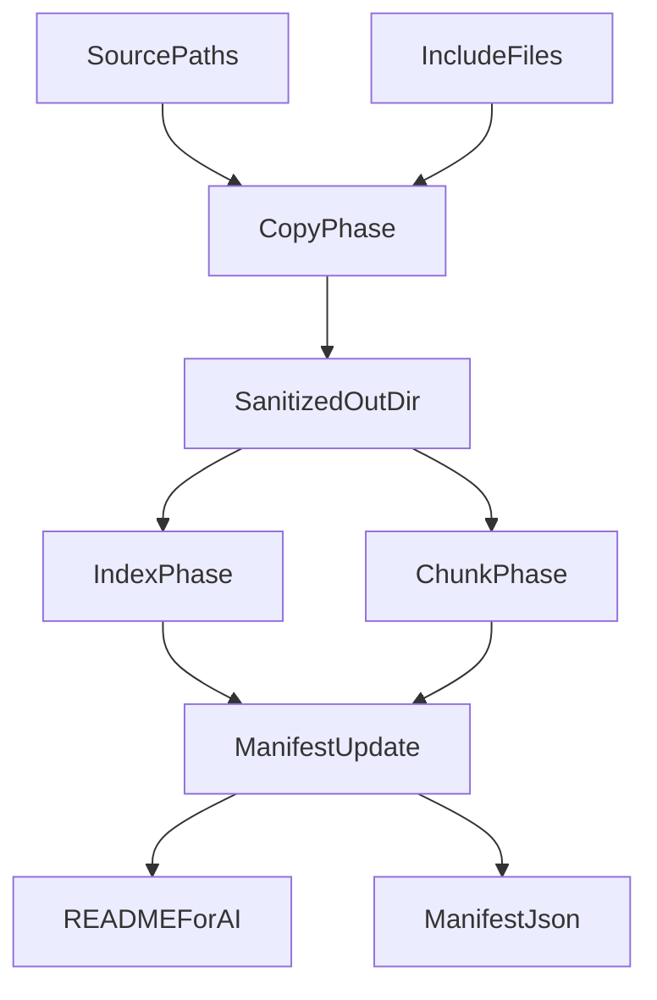

# index + chunk 実装計画

## スコープ
初回実装は `bundle` を含めず、`index + chunk` の最小実装に限定する。既存の export 済みファイル群を入力として、NotebookLM と Gemini チャットで再利用しやすい索引とチャンクを出力する。

## 実装方針
- 既存の 1 ファイル単位 export は [`tools/gemini-export/copy-pipeline.mjs`](tools/gemini-export/copy-pipeline.mjs) の責務に残し、ここは原則変更しない。
- 追加処理は [`tools/gemini-export/cli.mjs`](tools/gemini-export/cli.mjs) から呼ぶ後段フェーズとして実装する。
- フェーズの差し込み位置は、`sourcePaths` / `includeFiles` のコピー完了後、`README_FOR_AI.md` 生成前とする。ここで `outDir` 配下のサニタイズ済みファイルを読んで `index` と `chunk` を生成し、その結果を `manifest` に載せる。
- 純粋ロジックは [`tools/lib/gemini-export-pure.mjs`](tools/lib/gemini-export-pure.mjs) か隣接する pure モジュールに寄せ、CLI 依存と分離する。

## 追加する出力物
- `PROJECT_INDEX.md`
  - 人間と AI の両方が読む概要索引
- `PATH_INDEX.jsonl`
  - 元パス、種別、要約、関連パスなどの機械可読な索引
- `chunks/`
  - 元パスと `chunk_id` を持つ精読用ファイル群

## 変更対象
- [`tools/gemini-export/default-config.mjs`](tools/gemini-export/default-config.mjs)
  - `indexChunk` などの設定ブロックを追加する
  - 候補: `enabled`, `projectIndexFile`, `pathIndexFile`, `chunksDir`, `maxChunkBytes`, `chunkExtensions`
- [`tools/gemini-export/config.mjs`](tools/gemini-export/config.mjs)
  - 新設定の読込・既定値マージ・検証を追加する
  - `maxChunkBytes` の数値検証、出力相対パスの安全性検証、`chunkExtensions` の配列検証を行う
- [`tools/gemini-export/cli.mjs`](tools/gemini-export/cli.mjs)
  - export 完了後に `index + chunk` 生成フェーズを呼ぶ
  - `manifest` に `indexFiles`, `chunkFiles`, `chunkCount` などを追加する
  - `--check` 時の扱いを既存挙動とそろえる
- [`tools/gemini-export/readme.mjs`](tools/gemini-export/readme.mjs)
  - `README_FOR_AI.md` に `index/chunk` の要約を追加する
- [`tools/lib/gemini-export-pure.mjs`](tools/lib/gemini-export-pure.mjs)
  - チャンク分割、`chunk_id` 生成、索引メタデータ整形などを追加する

## データフロー

## テスト計画
- Unit
  - [`test/unit/gemini-export-validate-config.test.mjs`](test/unit/gemini-export-validate-config.test.mjs): `indexChunk` 設定の不正値検証
  - [`test/unit/gemini-export-load-config.test.mjs`](test/unit/gemini-export-load-config.test.mjs): `indexChunk` の既定値マージ
  - [`test/unit/gemini-export-pure.test.mjs`](test/unit/gemini-export-pure.test.mjs) または新規 unit: チャンク分割と `chunk_id` 生成
- Integration
  - [`test/integration/export-cli.test.mjs`](test/integration/export-cli.test.mjs): `PROJECT_INDEX.md`, `PATH_INDEX.jsonl`, `chunks/` の生成確認
  - `--check` 時に追加出力を作らないことの確認
  - 既定で無効なら従来どおり追加ファイルが出ないことの確認

## 実装順
1. [`tools/gemini-export/default-config.mjs`](tools/gemini-export/default-config.mjs) と [`tools/gemini-export/config.mjs`](tools/gemini-export/config.mjs) に `indexChunk` 設計を追加する。
2. pure ロジックを [`tools/lib/gemini-export-pure.mjs`](tools/lib/gemini-export-pure.mjs) に追加し、ユニットテストを先に固める。
3. `index + chunk` 生成フェーズを新規モジュールで実装し、[`tools/gemini-export/cli.mjs`](tools/gemini-export/cli.mjs) から呼ぶ。
4. [`tools/gemini-export/readme.mjs`](tools/gemini-export/readme.mjs) と `manifest` 出力を拡張する。
5. [`test/integration/export-cli.test.mjs`](test/integration/export-cli.test.mjs) を更新し、`npm run test` と `npm run lint` で確認する。

## 完了条件
- `indexChunk` 設定を有効にすると `PROJECT_INDEX.md`, `PATH_INDEX.jsonl`, `chunks/` が生成される
- 生成物に元パスと最低限のメタデータが含まれる
- `manifest.json` と `README_FOR_AI.md` に `index/chunk` の要約が載る
- `--check` を含む既存 CLI の挙動を壊さない
- テストと lint が通る